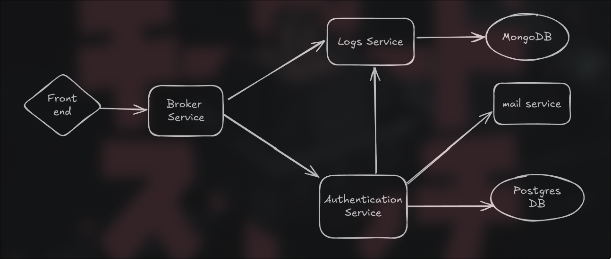

# Microservices Project

This project is a microservices-based system with the following services:
1. **Broker Service** - Routes incoming requests to the appropriate services.
2. **Authentication Service** - Handles user authentication and connects to a PostgreSQL database.
3. **Logger Service** - Logs authentication events and other service interactions in a MongoDB database.
4. **Mailer Service** - Sends emails using SMTP, tested locally with MailHog.
5. **Front-end Service** - Basic front-end interface to interact and test microservices.

## Project Structure

```plaintext
/Go-MicroServices
├── broker-service/
├── auth-service/
├── logger-service/
├── mailer-service/
├── front-end/
├── project/
│   └── docker-compose.yml
│   └── swarm.yml
│   └── makefile
└── README.md
``` 

## Services Overview




### Broker Service
The **Broker Service** acts as the main entry point, handling client requests and routing them to the appropriate services (Authentication, Logger, Mailer).

### Authentication Service
The **Authentication Service** manages user login, and authentication functionality. It connects to a **PostgreSQL** database to store user credentials.

### Logger Service
The **Logger Service** records events related to authentication and other interactions between services. It uses **MongoDB** as a database for logging purposes.

### Mailer Service
The **Mailer Service** is responsible for sending emails. It uses **SMTP** and is tested using **MailHog** for local development.

## Prerequisites

- Docker & Docker Compose
- PostgreSQL and MongoDB
- MailHog (for email testing)
- `.env` files for each service with appropriate configurations.


## Run with Docker Compose

- Ensure Docker and Docker Compose are installed.
- Start the entire system with Docker Compose:
```bash
  docker-compose up --build
```

#### Alternatively, you can use a Makefile to simplify the command:
```bash
  make up
```
This command is equivalent to docker-compose up --build, simplifying startup if you frequently rebuild the containers.


